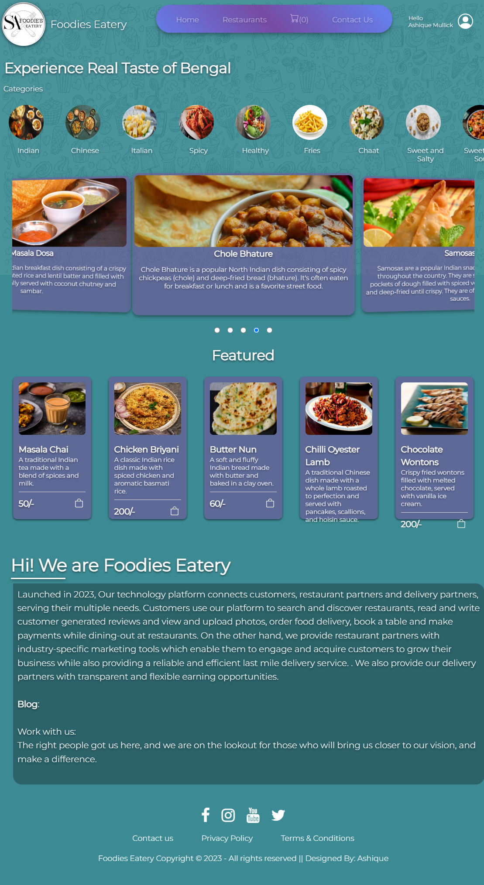
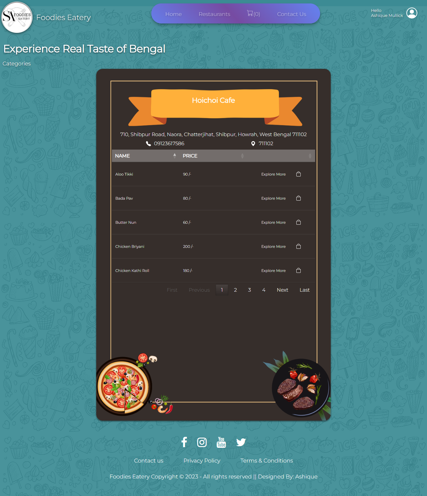
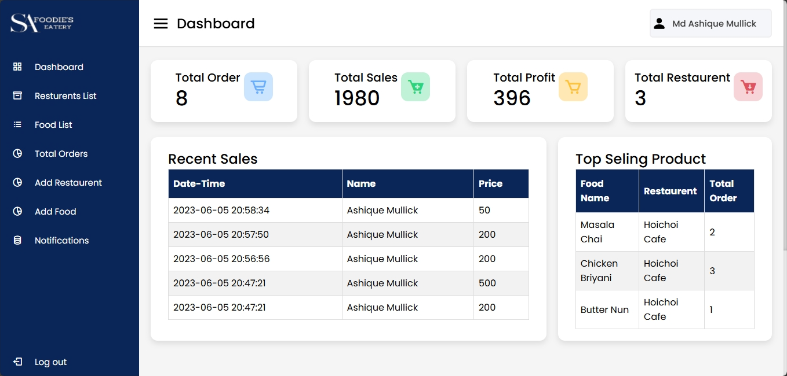
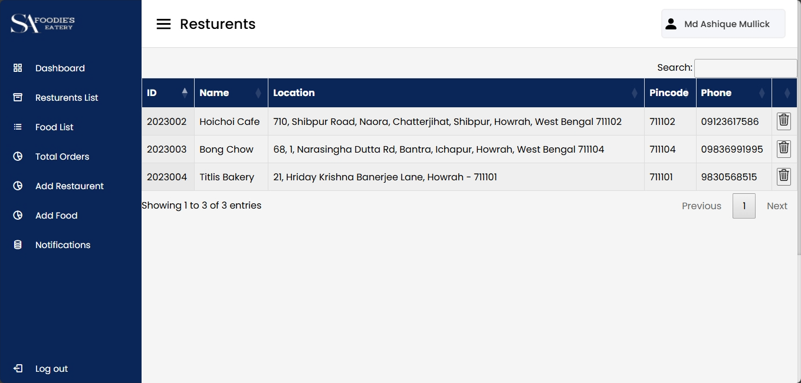
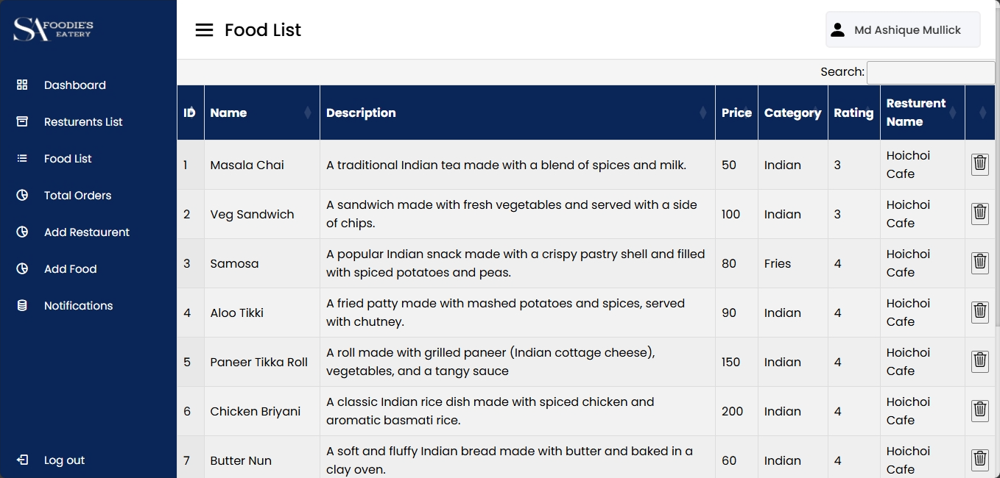

# Foodies Eatery (Online Food Ordering Web App)

  

## Technologies
- PHP
- HTML
- CSS
- JavaScript
- MySQL

## Overview
Foodies Eatery is a responsive web application designed for seamless online food ordering with integrated user and order management features. The app allows customers to browse menus, place orders, and track them efficiently.

## Features
- **User Authentication**: Secure login and registration for users.
- **Order Management**: Users can place and track their orders in real time.
- **Admin Dashboard**: Admins can register restaurants and their food items, view analytics (total orders, profits, sales), and manage user and order details.

## Contribution
Developed core features such as user authentication, order tracking, and the admin dashboard for managing restaurants, food items, and business analytics.

## Screenshots
Below are some screenshots of the website:

  <table>
    <tr>
      <td></td>
      <td></td>
      <td></td>
    </tr>
    <tr>
      <td></td>
      <td></td>
      <td></td>
    </tr>
    <tr>
      <td></td>
      <td></td>
      <td></td>
    </tr>
    <tr>
      <td></td>
      <td></td>
      <td></td>
    </tr>
    <tr>
      <td></td>
      <td></td>
    </tr>
  </table>

[GitHub Link](https://github.com/ashique543/Foodies-Eatery)
